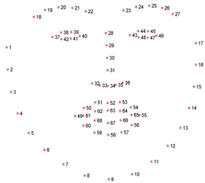

# 1. Image-Denoising

- [1. Image-Denoising](#1-image-denoising)
- [2. Description](#2-description)
- [3. Installation](#3-installation)
  - [3.1. Prerequisites](#31-prerequisites)
  - [3.2. Steps](#32-steps)
- [4. About Datasets](#4-about-datasets)


# 2. Description

Image denoising project is a research to explore new methods to remove the noise present in faces images.

# 3. Installation

To get started with the project, you'll need to set up a Conda environment using the provided `environment.yml` file.

## 3.1. Prerequisites

- [Conda](https://docs.conda.io/projects/conda/en/latest/index.html)

## 3.2. Steps

1. Clone the repository:

   ```bash
   git clone https://github.com/migliorin/Image-Denoising.git

# 4. About Datasets
The experiments were done using the following datasets:
 - [AFW](https://ibug.doc.ic.ac.uk/resources/facial-point-annotations/)
   - AFW follow the annotation
  
      
